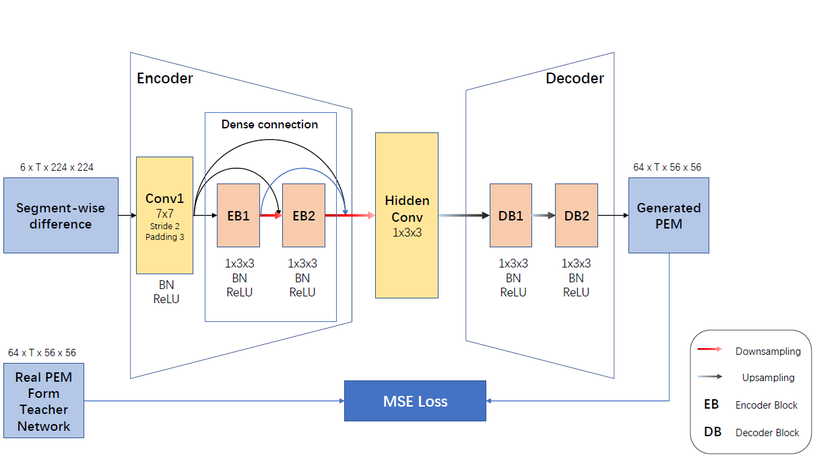

# MOTion-Estimator
 
## Overview
We release the PyTorch code of [MOTE].


The code is majorly based on [TDN](https://github.com/MCG-NJU/TDN) and utilize TDN as the teacher network for generating motion information.

**MOTion Estimator (MOTE)** is a simple but efficient module for feature-level enhancement of action recognition algorithms, the pipeline is demonstrated in the figure above.

We separately train our MOTE module with the teacher network, and transplant it to the existing algorithms as enhancement. 

The detailed structure of MOTE is shown in the figure below:




The detailed data pre-processing and preperation strategies follow the settings of [TSM](https://github.com/mit-han-lab/temporal-shift-module).

## Prerequisites
The code is built with following libraries:

- [PyTorch](https://pytorch.org/) 1.6.0 or higher
- [TensorboardX](https://github.com/lanpa/tensorboardX)
- [tqdm](https://github.com/tqdm/tqdm.git)
- [scikit-learn](https://scikit-learn.org/stable/)

## Training
1. Train MOTE with the corresponding pre-trained teacher network.
Referring to ```z_generating.sh```.

2. Enhance the existing algorithms with trained MOTE.
We should first copy the checkpoint trained in the former step to the corrersponding folder and **rename it as "ckpt_best_step1.pth"**, then launch the training.
Referring to ```z_step2_training.sh```. 

Be careful with part from line 92 to 109 in file ```ops/models```, for the transplantation, please switch the part of the comment.

## Testing
```z_testing.sh``` is provided for testing.

Checkpoints of teacher network, MOTE and the transplanted models can be downloaded [here](https://drive.google.com/drive/folders/1yMN1qkXd8Ni6Tl5ZaJoRp2CM8SOfPo-S?usp=sharing).

## Citation